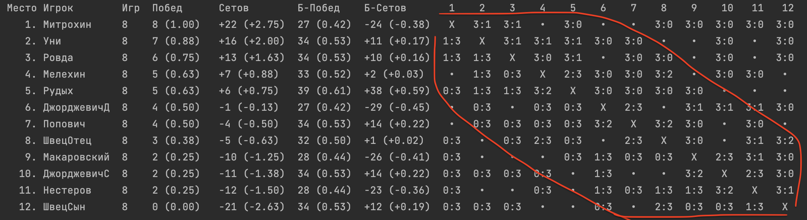

# Памятка организатору турнира (перед его началом)

### Что это за программа

Существуют разные форматы проведения турниров (например, по настольному теннису).

**Круговая система** (одна группа, в которой все играют со всеми) — наиболее простая и удобная для проведения.
Но если уровень мастерства игроков варьируется в очень широких пределах (то есть, разница в мастерстве
сильнейших и слабейших слишком велика), то многие матчи
получаются "проходными" (результат игры предрешён заранее, а игра скучна для обоих игроков).

Игрокам было бы интереснее играть с игроками, не отличающимися от них по уровню мастерства радикально.

Это решает **[Швейцарская система проведения турниров](https://ru.wikipedia.org/wiki/Швейцарская_система)**.
В рамках этой системы, пары на каждый следующий тур составляются так, чтобы друг против друга играли участники, занимающие близкие позиции
в текущей турнирной таблице — а значит, имеющие схожий уровень игры.

Минус этой системы заключается в том, что спланировать очередной тур можно только после того, как полностью доигран предыдущий. То есть,
получается, что игроки, сыгравшие свой очередной матч, должны ждать, пока доиграют все остальные. Также простаивают столы — и пока
доигрываются самые затянувшиеся игры, и во время планирования очередного тура.

Данная программа предлагает решение этих проблем: комбинированную систему, основанную на швейцарской. Как только появляется свободный стол,
программа ставит туда пару свободных в данный момент игроков с максимально близким друг к другу положением в турнирной таблице, которые
ещё не играли между собой. Таким образом, устраняются простои стола (все столы всегда заняты), но сохраняется дух швейцарской системы, а
именно её главное преимущество — игроки играют с игроками, близкими к ним по уровню игры.

### О гибкости программы

Программа сделана очень гибкой. Вот, например, что она позволяет:

1. Можно начинать турнир, даже когда ещё не все пришли: опоздавший участник может войти в турнир в любой момент.
   Ему с самого начала будут подбираться подходящие по уровню соперники, и он будет играть чаще,
   пока не догонит остальных по количеству сыгранных игр.
2. Можно в любой момент сменить количество доступных для игры столов: программа сразу подстроится и заполнит все свободные столы.
3. Можно по ходу турнира менять количество матчей, которые должен сыграть каждый человек, в зависимости от того, сколько времени аренды
   столов осталось. Система корректно подстроится. Но очевидно, система ничего не сможет сделать в случае,
   если кто-то уже сейчас сыграл больше матчей, чем нужно всего. Поэтому лучше сначала поставить количество матчей поменьше (сколько мы
   точно успеем сыграть), а в процессе турнира увеличивать это число, если понятно, что остаётся время.
4. Организатор турнира в любой момент может вместо предложенных программой пар составить пару по своему желанию. Система это корректно
   обработает и учтёт это в своих дальнейших действиях.
5. Можно вносить любые исправления в прошлом: например, менять результат матча, убрать матч из списка сыгранных игр, добавить матч в
   список сыгранных игр, исправить состав соперников
6. Важно: запрещается ситуация, когда один участник играет с другим больше одного раза. Программа никогда не поставит какую-то пару второй
   раз. И при
   исправлении истории, также нельзя указывать, что какие-то игроки сыграли друг с другом больше одного раза — такие вводные будут
   некорректными.
7. Также нельзя исключить из турнира игрока, который сейчас сыграл хотя бы один раз. Удалить его из турнира можно только вместе
   со всей историей сыгранных им игр (результаты этих игр также удалятся и у его соперников).

Программа всегда следит за тем, чтобы сетка корректно складывалась при том, что каждый должен сыграть строго заданное количество игр.
Например, никогда не будет ситуации, что двум игрокам осталось доиграть по одной игре, но между собой они уже играли. Программа разрулит
эту ситуацию заблаговременно, выставив все пары так, чтобы в такую ситуацию не попасть.
Но это может оказаться невозможным в случае, если организатор турнира не следует рекомендациям программы, а ставит пары сам. Либо если
организатором внесено исправление в историю сыгранных игр, которое привело к тому, что спланировать оставшиеся игры корректно невозможно.

Если в турнире нечётное количество игроков, то ровно один игрок сыграет ровно на один матч меньше.

### Возможность указать гандикап

Можно в начале файла `tournament.txt` указать параметр `ГандикапТуров <число>`, а после всех или некоторых игроков
указать два числа через пробел: число гандикап-побед и гандикап-поражений. Например, запись:

```csv
Игрок Антон 2 1
```

означает, что в 3 воображаемых гандикап-играх, проведённых как бы до начала турнира, Антону назначено 2 победы и 1 поражение.
Эти игры и победы не будут отображаться в таблице, никак не будут учитываться в результатах, но будут учитываться при выборе
соперника в нескольких первых турах (их количество указано в параметре `ГандикапТуров`).
Это позволяет избежать игр между сильными и слабыми соперниками в нескольких первых турах. Без гандикапа, например, пары на первый тур
формируются абсолютно случайно, и сильный игрок может попасть на слабого. А во втором туре сильный, победивший другого сильного, может
попасть на слабого игрока, который победил ещё более слабого.

### Возможность поставить игрока на паузу

В строке с указанием имени игрока (`Игрок Антон`) можно поставить минус перед именем игрока (`Игрок -Антон`) и таким образом указать,
что игрок отошёл, либо по каким-то другим причинам новые матчи с его участием назначать сейчас не нужно до тех пор,
пока не будет убран минус перед его именем. Действующий матч с его участием остаётся корректным и может быть успешно доигран, а его счёт
прописан.

В случае постановки игрока на паузу, он остаётся полноценным участником турнира: сетка планируется с учётом того, что он в конце концов
сыграет нужное количество матчей.

### Как работает алгоритм выбора каждой следующей пары на матч

1. Берутся все свободные сейчас игроки (то есть те, которые не играют матч прямо сейчас и не поставлены на паузу)
2. Исключаются те, кто уже сыграл заданное в настройках максимальное количество матчей, которое должен сыграть каждый игрок
3. Из оставшихся после этого кандидатов составляются все возможные пары игроков
4. Исключаются пары, которые уже играли друг с другом
5. Исключаются пары, при выборе которых дальнейшая сетка турнира не может сойтись в принципе
   (то есть, мы окажемся в ситуации, когда двум игрокам осталось доиграть по одной игре, но между собой они уже играли)
6. Оставшиеся пары сравниваются по текущему проценту побед (в первых турах — с учётом гандикапа, если он есть).
   За стол ставится пара игроков, которые имеют максимально близкий друг к другу процент выигранных матчей в турнире к текущему моменту.
7. При этом, приоритетом обладают игроки, которые сыграли на этом турнире меньше всего игр. Такие игроки, если есть возможность,
   ставятся к столу в первую очередь.

### Как настроить программу перед началом турнира

1. Выбрать количество столов.
   Берём столов от 30% до 40% от числа участников – меньше столов, если хотим более качественный выбор игр с ровными по уровню соперниками,
   больше столов если хотим меньше пауз. Столы гарантированно всегда будут заполнены.
   Проблема с выбором равных по уровню соперников может встать только в конце турнира и только в случае, если число матчей,
   которые должен сыграть каждый игрок, близко к общему числу игроков (то есть каждый должен сыграть почти со всеми).
2. Необходимо внести настройки ("Столов", "Матчей", "ГандикапИгр", а также сформировать список игроков), убедиться что список сыгранных игр
   пуст.
3. Если число матчей, которые должен сыграть каждый человек, сильно меньше общего числа участников турнира, то лучше прописать гандикапы
   на основании рейтинга игроков или известного уровня. Это позволит в первых турах развести по разным играм игроков разного уровня, пока
   не успелась сформироваться достаточно объективная картина. В качестве альтернативы, можно составить пары вручную.
   Например, на 12 человек: 1 с 7, 2 с 8, ..., 6 с 12.
   Если же каждый в любом случае должен сыграть почти с каждым, то расставлять игроков по силе в первом круге не нужно,
   пусть машина всё сделает автоматически.
4. Если организатор тоже играет, то обязательно рассказать участникам, как пользоваться системой самостоятельно.
5. Раскрыть нижнюю панель на такую высоту, чтобы полностью помещалась таблица. Сверху открыть `tournament.txt`.

# Памятка участникам, как пользоваться программой самостоятельно во время турнира

### Если ты доиграл свой матч

1. Внести в файл tournament.txt свой результат (он открыт в верхней части экрана). Просто через пробел результат первого и второго игрока.
2. Запустить программу (нажать на зелёный треугольник наверху экрана, либо Ctrl+R (^+R) на клавиатуре).
3. Посмотреть, кого программа следующими ставит к столу. **Обязательно (!)** им об этом сообщить.
4. При желании, можно посмотреть внизу экрана обновлённую таблицу.

### Как читать таблицу

Вот пример того, как выглядит таблица по итогам реального турнира:


Красными линиями отмечен наиболее плотный по доле сыгранных матчей кусок в середине матрицы. Это подтверждает то, что игроки
действительно наибольшее количество игр проводили с игроками схожего уровня.

1. Таблица отсортирована по текущему месту игрока в турнире.
2. Затем указано количество сыгранных игр. Если игрок играет очередную игру сейчас — после числа выводится звёздочка.
3. Текущее место определяется количеством побед.
   При равенстве — [коэффициентом Бергера](https://ru.m.wikipedia.org/wiki/Коэффициент_Бергера), то есть,
   количеством побед у всех, с кем вы сыграли (в итоге те, кто сыграл с более сильными соперниками, будут в таблице выше).
   Если и по этому показателю равенство, то учитывается баланс выигранных сетов. И, наконец, баланс выигранных сетов по Бергеру (то есть,
   суммарный баланс сетов у всех, с кем вы сыграли).
4. Так как в середине турнира у разных игроков может быть разное количество сыгранных на данный момент игр, в скобках к каждому показателю
   указывается то же значение, нормированное по количеству сыгранных матчей (делённое на их количество).
   И в ходе турнира сортировка таблицы производится именно по этому показателю.
5. В конце в таблице выводится матрица сыгранных игр.
